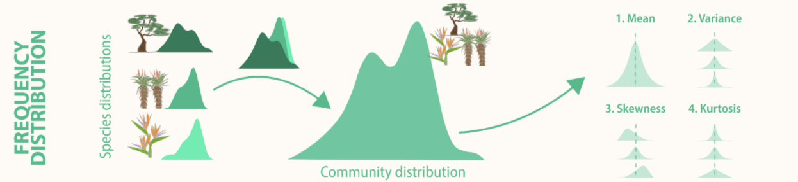
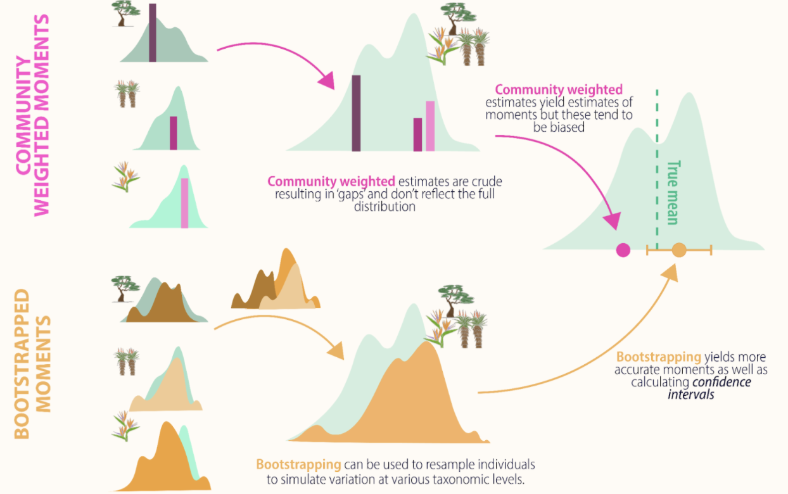

```{r, setup, include = FALSE}
knitr::opts_chunk$set(
  collapse = TRUE,
  comment = "#>"
)

library(traitstrap)
library(dplyr)
library(tidyr)
library(stringr)
library(purrr)
library(ggplot2)

# wes anderson colours
col_palettes <- list(
  GrandBudapest1 = c("#FD6467", "#5B1A18", "#D67236")
)
theme_set(theme_minimal(base_size = 12))
```

<!-- fig.align = 'right',  -->
```{r hex, echo=FALSE, out.width='15%', out.extra='style="float:right; padding:8px"'}

```

This vignette explains how to use the traitstrap package (Telford et al 2023).
For more details on the methods see [Maitner et al. (2021)](https://doi.org/10.22541/au.162196147.76797968/v1). 

First of all, relax and turn on some music. We have prepared the [traitstrap playlist](https://tinyurl.com/traitstrap) for you!


## The aim of traitstrap

Trait distributions can be used to infer the importance of community assembly processes and the role of climate drivers in shaping species and community responses to climate change.
Community ecology has typically focused on the **mean**, however the **higher moments** (variance, skewness, and kurtosis) of trait distributions can reveal information about the various processes shaping species diversity.

```{r true-dist, echo=FALSE, out.width='90%'}

```

Measuring trait distributions is often difficult and time-consuming as it requires information on measuring trait values of all individuals present.
Sampling protocols often limit sampling to a non-representative subset of the community, or rely upon species-level average traits values calculated in other locations or across many locations.

Traditionally the moments of trait distributions have been estimated using weighting approaches that rely on the average traits of species weighted by some measure of abundance within the community.
Such **community-weighted** trait moments methods assume that a species’ trait expression can be adequately represented by the mean, ignoring intraspecific trait variation.

To more accurately estimate local trait distributions, trait sampling should thus occur both across multiple individuals within each species, and across multiple locations or experimental treatments across the extent of the study in order to capture both inter- and intra-specific variability.

```{r comm-boot, echo=FALSE, out.width='90%'}

```

**Traitstrap** is an **R package** to estimate the moments of community trait distributions using a **bootstrapping approach**.
Further, this package uses a hierarchical sampling design, which allows accounting for incomplete trait collections, traits from different spatial or temporal levels (e.g. local traits vs. databases), taxonomic hierarchies (e.g., species vs genus)  and experimental designs (e.g., multiple sites, or treated vs. control sampling units).

The package has three **main functions**:

* **trait filling** function which allows to account for intraspecific trait variation and hierarchical sampling design.
* a resample method using **bootstrapping** (parametric or nonparametric method) to calculate community weighted mean and happy moments (variance, skewness and kurtosis).
* a **summary function** that summarizes the trait moments and calculates confidence intervals.

Note that for this tutorial we are calling the mean and the higher moments the happy moments :-)


## The data

For this vignette we will use part of a vascular plant dataset from two sites near Longyearbyen on Svalbard. 
The data was collected during the Plant Functional Trait Course in 2018 and contains data on the plant community composition and functional traits.
For more details see this [GitHub repo](https://github.com/Plant-Functional-Trait-Course/PFTC_4_Svalbard)

Note that some of the species names have been adapted. 

```{r data-prank, echo=FALSE, eval=TRUE}
community <- community |>
  mutate(Taxon = case_when(
    Taxon == "equisetum scirpoides" ~ "enquistetum scirpoides",
    Taxon == "micranthes hieracifolia" ~ "maitneranthes hieracifolia",
    Taxon == "bistorta vivipara" ~ "bistorta vigdis",
    Taxon == "stellaria humifusa" ~ "stelfordaria humifusa",
    Taxon == "oxyria digyna" ~ "oxyria tanyna",
    Taxon == "silene acaulis" ~ "silene acaudis",
    TRUE ~ Taxon
  ))

trait <- trait |>
  mutate(Taxon = case_when(
    Taxon == "equisetum scirpoides" ~ "enquistetum scirpoides",
    Taxon == "micranthes hieracifolia" ~ "maitneranthes hieracifolia",
    Taxon == "bistorta vivipara" ~ "bistorta vigdis",
    Taxon == "stellaria humifusa" ~ "stelfordaria humifusa",
    Taxon == "oxyria digyna" ~ "oxyria tanyna",
    Taxon == "silene acaulis" ~ "silene acaudis",
    TRUE ~ Taxon
  ))

# shorten trait names
trait <- trait |>
  mutate(Trait = recode(Trait, "Leaf_Thickness_Ave_mm" = "Thickness_mm"))
```


## Organize your data

To run traitstrap two datasets are required: 

* one dataset with information on abundance (e.g. biomass, size, cover, etc.) of the community, which is used to weight species traits by abundance in the community.
* one dataset with the traits for each species (or as many species and individuals you have data for) in your community.

The datasets need to be organized in a **tidy** and **long** format and certain columns (see below) are required, but the naming of these columns are up to the user.

Let us have a look at these datasets in an example.

The **community data** should have information the abundance of species in the community.
This dataset will be used to weigh the traits by species abundance.
Note that abundance can also be cover, size, biomass, or something similar.

In this example the contains species names (e.g. **Taxon**), cover of each species per plot (e.g. **Cover**) and two columns with information about the **hierarchy** (i.e. **Site** and **PlotID**).


```{r comm-data, echo=FALSE, eval=TRUE}
community
```


The **trait data** should contain information about traits and trait values for as many species and individuals in the community data as possible.
The data should be organized in the same way as the community data and should have corresponding columns.
In this example the trait data contains **Taxon**, **Site** and **PlotID** as well as **Trait** and **Value**.

```{r trait-data, echo=FALSE, eval=TRUE}
trait
```


## Trait filling

The `trait_fill()` function uses a hierarchical sampling design, which allows to account for incomplete trait collections, traits from different spatial or temporal levels (i.e. local traits vs. databases), different taxonomic resolution and/or experimental design. 

The first two mandatory arguments in the function are the two datasets:
`comm` and `traits`

The next four arguments are also mandatory and refer to specific columns in the trait or community dataset:

* `abundance` which is the abundance of your species in your community dataset. This can be abundance, cover, biomass, or size, etc.
* `taxon_col` is the column in your community and trait data that define the species.
* `trait_col` is the column in your trait data that defines the traits.
* `value_col` is the column in your trait data that defines the trait values.

All the other arguments are not mandatory.

With `scale_hierarchy` you can define the levels at which the traits have been collected and the order of trait filling starting with the highest level (e.g. global database, regional, site, plot).
In the example below we have the levels **Site** and **PlotID**, starting with the highest level.

The `trait_fill()` function will choose if available a trait value from the lowest level, i.e. species X from plot A in site 1.
If no trait value is available from that level (plot A, site 1), it will other groups in the same level and choose a trait value from species X from plot B or C at site 1.
If there is no trait available, it will move up the hierarchy to the next level and choose trait values from species X from other sites (site 2, 3, etc.).

The argument `min_n_in_samples` allows users to define the minimum number in samples that are chosen at each level.
If the minimum number is not reached (i.e. there are only 3 trait values at a specific level), trait values from the next higher level will be filled, to avoid sampling the same individual several times, which could result in unrealistic variances.
The default minimum number of samples is 5.

In the `other_col` argument other grouping variables in the community dataset can be defined and will be kept after the trait filling.


```{r trait-fill, echo=TRUE, eval=TRUE}
trait_filling <- trait_fill(
  # input data (mandatory)
  comm = community,
  traits = trait,

  # specifies columns in your data (mandatory)
  abundance_col = "Cover",
  taxon_col = "Taxon",
  trait_col = "Trait",
  value_col = "Value",

  # specifies sampling hierarchy
  scale_hierarchy = c("Site", "PlotID"),

  # min number of samples
  min_n_in_sample = 9
)

trait_filling
```


Traitstrap also allows to include taxonomy and experimental design in the trait filling step.

With the argument `taxon_col` the taxonomic hierarchy for sampling can be defined.
This means if traits for a specific species are not available, trait values from the same genus will be used.
For this a list of the taxonomic hierarchy has to be defined (e.g. "Taxon", "Genus").
Note that traits from species of the same genus can have very different traits and it might not be meaningful to use these traits.
Therefore, you should always check the trait distributions for the same genus before using taxonomic trait filling.

The argument `treatment_col` allows to incorporate an experimental design where traits are filled from the same experimental treatment or the first factor level, which is assumed to be the control.
Therefore, it is important to order the levels of a treatment in the right order, i.e. the first level has to be the control.
The filling step can be defined at certain level using the `treatment_level` argument.
Depending on the experimental design it might make sense to fill traits at a certain level, e.g. block or site.

Here is an example how to include taxonomy and experimental design in the trait filling function (code not run).

```{r trait-fill2, echo=TRUE, eval=FALSE}
trait_filling2 <- trait_fill(
  comm = community,
  traits = trait,
  abundance_col = "Cover",

  # defining taxonomic hierarchy
  taxon_col = c("Taxon", "Genus"),
  trait_col = "Trait",
  value_col = "Value",
  scale_hierarchy = c("Site", "PlotID"),
  min_n_in_sample = 3,

  # specifying experimental design
  treatment_col = "Treatment",
  treatment_level = "Site",
)
```


## Nonparametric bootstrapping

The output of the trait filling function is then used to do a **nonparametric bootstrapping** using the `trait_np_bootstrap()` function.

Nonparametric bootstrapping is a resampling method to estimate the trait moments.
The traits are re-sampled in proportion to their weight in the community (e.g. by the abundance of the species).

The trait values across all individuals in a community are resampled n times (`sample_size`; the default is 200) to incorporate the full spectrum of trait variation, generating n number (`nrep`; the default is 100) of trait distributions.

From these trait distributions the happy moments are estimated: **mean**, **variance**, **skewness** and **kurtosis**.

This function also allows to extract raw distributions by setting the argument `raw = TRUE`.
The raw data can be useful for visualizing the trait distributions.
If the raw data is extracted, `nrep` is forced to 1 to avoid memory issues. 


```{r non-parap-boot, echo=TRUE, eval=TRUE}
# run nonparametric bootstrapping
np_bootstrapped_moments <- trait_np_bootstrap(
  trait_filling, 
  nrep = 50
)

np_bootstrapped_moments
```

One advantage of using a bootstrapping approach, is that we get much more than a mean trait value.
We can also estimate the variance and other moments of these trait distributions.
In traitstrap happy moments can be summarized and the confidence intervals calculated using the `trait_summarise_boot_moments()` function.
The input variable for this function is the output from the nonparametric bootstrapping function (or the parametric bootstrapping function, see below).

The confidence interval can be calculated parametrically, using the mean and standard deviation, or nonparametrically using quantiles.
The default is using the mean and standard deviation (`parametric = TRUE`) with one standard deviation around each trait moment (`sd_mult = 1`).
For the nonparametric approach the default is a 0.95 confidence level.


```{r summarize, echo=TRUE, eval=TRUE}
# summarizes bootstrapping output
sum_boot_moment <- trait_summarise_boot_moments(
  np_bootstrapped_moments
)

sum_boot_moment
```


## Parametric bootstrapping

Traitstrap also offers the option to run a **parametric bootstrapping**.

The `trait_fit_distributions()` function fits parametric distributions for each species-by-trait combination at the finest scale of the user-supplied hierarchy. 
This function takes as input:

* an object of class filled traits (as produced by the function `trait_fill`), and 
* the type of distribution to be fitted.

Either a single distribution type can be used for all traits, or traits can be assigned specific distributions types by supplying the function with a named vector of traits (e.g. `c(height = "normal", mass = "lognormal")`).

Currently the function supports normal, log-normal, and beta (values between 0 and 1) distributions.

The function returns a dataframe containing fitted distribution parameters.

```{r fit-dist, echo=TRUE, eval=TRUE}
# fit distributions
fitted_distributions <- trait_fit_distributions(
  filled_traits = trait_filling, 
  distribution_type = "lognormal"
)

fitted_distributions
```


```{r fit-dist2, echo=TRUE, eval=FALSE}
# fit several types of distributions
fitted_distributions <- trait_fit_distributions(
  filled_traits = trait_filling,
  distribution_type = c(Plant_Height_cm = "normal", 
                           Wet_Mass_g = "lognormal")
)

fitted_distributions
```


The `trait_parametric_bootstrap()` function is a parametric analogue of the `trait_np_bootstrap()` function.
It takes in fitted trait distributions produced by `trait_fit_distributions` and randomly samples from among the fitted distributions proportionally to species abundances in the community.

As with `trait_np_bootstrap()`, the number of samples per replicated draw are specified with the parameter `sample_size`, and the number of replicated draws is specified by the parameter `nrep.`
The argument `raw` allows to extract raw distributions (see above).


```{r para-boot, echo=TRUE, eval=TRUE}
# run parametric bootstrapping
p_bootstrapped_moments <- trait_parametric_bootstrap(
  fitted_distributions = fitted_distributions,
  nrep = 50
)

p_bootstrapped_moments
```

The output of trait_parametric_bootstrap can be summarized using `trait_summarize_boot_moments()` (see above).


## Extracting raw distributions

In traitstrap both the parametric and nonparametric bootstrapping functions allow returning raw trait distributions.


```{r raw-dist-np, echo=TRUE, eval=TRUE}
# run nonparametric bootstrapping
raw_dist_np <- trait_np_bootstrap(
  filled_traits = trait_filling,
  raw = TRUE
)

raw_dist_np
```

The raw data can be useful for visualizing the trait distributions.

Use colour and facets to separate between the different traits, hierarchies and treatments.

```{r plot-raw-dist-np, echo=TRUE, eval=TRUE, fig.width = 6}
ggplot(raw_dist_np, aes(x = log(Value), fill = Site)) +
  geom_density(alpha = 0.4) +
  scale_fill_manual(values = col_palettes$GrandBudapest1) +
  labs(x = "log(trait value)") +
  facet_wrap(facets = vars(Trait), scales = "free")
```

## Multivariate analyses

While the core functionality of traitstrap was designed with univariate distributions in mind, it can also be used for multivariate questions as well using the function `trait_multivariate_bootstrap()`. 
This function allows users to supply any appropriate function for analyses of multivariate data, including those included in popular packages for functional diversity calculations. 
Here, we demonstrate how to combine `trait_multivariate_bootstrap()` with the function `dbFD()` from the FD package.

We first use the `trait_fill()` function similar to the univariate case.
Note that we are also using the argument `complete_only` to specify that we are only interested in individuals that have all traits and the argument `leaf_id`, which tells the function which column contains the unique individual ID.
Also, we are subsetting the data to make it run faster.

```{r multivariate-prep, warning=FALSE}
library(FD)

multivariate_traits <- trait_fill(
  comm = community |>
    # to make the example faster, we'll only use a subset of plots
    filter(
      Site == "1",
      PlotID %in% c("A", "B")
    ),
  traits = trait,
  scale_hierarchy = c("Site", "PlotID"),
  taxon_col = "Taxon",
  value_col = "Value",
  trait_col = "Trait",
  abundance_col = "Cover",
  complete_only = TRUE,
  leaf_id = "ID"
)
```

Then we are using the `trait_multivariate_bootstrap()` function to do the actual bootstrapping.
This function needs the output from the trait filling as `filled_traits`, number bootstrapped of replications `nrep`, bootstrap size `sample_size` and `id`.
The last argument is `fun`, that takes any function to apply to the data.
In this case we are using diversity functions from the `dbFD` package.

Note that we are using a low number of replicates (nrep) to make it run faster. 

The `dbFD()` function returns a list as output, and we need to wrangle the data a bit to get it into a more useful format.
We will extract Rao's Quadratic Entropy, since that performs well with bootstrapping.

```{r multivariate-bootstrap, warning=FALSE}
boot_multi <- trait_multivariate_bootstrap(
  filled_traits = multivariate_traits,
  nrep = 5, # number of reps is set low for demo purposes
  sample_size = 200,
  id = "ID",
  fun = function(x) {
    dbFD(
      x = x,
      calc.FRic = FALSE,
      calc.FDiv = FALSE,
      calc.CWM = FALSE,
      stand.x = FALSE,
      scale.RaoQ = FALSE
    )
  }
)

# data wrangling
raoq_est <- boot_multi |>
  mutate(result = map(result, as.data.frame)) |>
  unnest(result)
```

Let's plot RaoQ:

```{r multivariate-plot, warning=FALSE, fig.width = 6}
ggplot(data = raoq_est, mapping = aes(x = RaoQ, fill = PlotID)) +
  geom_density(alpha = 0.5) +
  scale_fill_manual(values = col_palettes$GrandBudapest1) +
  xlim(c(0, 6))
```

Next, we'll show how we can use a similar method to combine `trait_multivariate_bootstrap` with the functions `TPDs()` and `REND()` from the TPD package.

For each replicated site, we convert the distribution into a trait probability distribution and then derive functional diversity metrics.

```{r multivariate-tpd, echo=TRUE, warning=FALSE, message=FALSE, fig.width = 6}
library(TPD)

boot_tpd <- trait_multivariate_bootstrap(multivariate_traits,
  id = "ID",
  nrep = 5, # Note that the number of reps is set low for demo purposes
  fun = function(x) {
    TPDs(
      species = rep(1, 200),
      traits = x
    ) |>
      REND(TPDs = _)
  }
)

# wrangling data
tpd <- boot_tpd |>
  mutate(result = map(result, as.data.frame)) |>
  unnest(result) |>
  pivot_longer(
    cols = species.FRichness:species.FDivergence,
    values_to = "value",
    names_to = "metric"
  ) |>
  mutate(metric = str_remove(metric, "species\\."))


# and make plot
ggplot(data = tpd) +
  geom_violin(
    mapping = aes(y = value, x = PlotID, fill = PlotID),
    alpha = 0.5,
    draw_quantiles = c(0.025, 0.975)
  ) +
  scale_fill_manual(values = col_palettes$GrandBudapest1) +
  facet_wrap(facets = vars(metric), scales = "free")
```


## Check your data

Traitstrap has a couple of functions to check the data.

The `coverage_plot()` function shows the trait coverage of the community for each level.
Basically, this function summarizes from which level the traits are filled, and how much coverage of the community is reached.

Based on simulations, we recommend to collect traits for at least 80% of the community cover (Maitner et al. in prep).

```{r coverage-plot, echo=TRUE, eval=TRUE, fig.width = 6}
# show coverage plot
autoplot(trait_filling) +
  scale_fill_manual(values = col_palettes$GrandBudapest1) +
  theme(axis.text.x = element_text(size = 8, angle = 90, vjust = 0.5))
```


Another important information is to know of which taxa traits are missing.
This can be useful if the data sampling is not finished and you want to know which species should be sampled.
The function also tells you the maximal abundance of each missing species, and gives you useful information if the missing species are abundant or rare.

Traitstrap has a function `trait_missing()` which gives you a table with all missing values.


```{r missing-traits, echo=TRUE, eval=TRUE}
# list missing traits
trait_missing(
  filled_trait = trait_filling,
  comm = community
)
```


